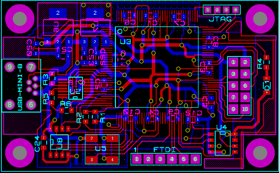

# XC6 Bus Pirate (FPGA based)

**This is a re-release of an old project from 2013/2014 but with recently updated RTL.**

The 'Bus Pirate' was an open-source universal bus interface module produced by [Dangerous Prototypes]http://dangerousprototypes.com/docs/Bus_Pirate).  
Back in 2013/2014, I decided to do a FPGA based version based around the Xilinx Spartan-6 with USB implemented in the FPGA fabric.  
Here was the [Hack A Day](https://hackaday.com/?s=fpga+bus+pirate) write-up.

At the time, RISC-V had yet to reach popularity so I implemented an OpenRISC based CPU with a SW based USB stack implementing USB-CDC (virtual serial port) protocol.
More recently, RISC-V has become the defacto open-source CPU ISA and is hugely more popular than OpenRISC ever was.

I have a number of well verified RISC-V implementations;
* [http://github.com/ultraembedded/biriscv](http://github.com/ultraembedded/biriscv)
* [https://github.com/ultraembedded/riscv](https://github.com/ultraembedded/riscv)

I also now have an HW based USB -> AXI Debug Bridge;
* [https://github.com/ultraembedded/core_usb_bridge](https://github.com/ultraembedded/core_usb_bridge)

This is more reliable than the SW implementation and frees up blockRAM for more useful things.

## Hardware
The HW design is very basic and was based around the hobbyist friendly Spartan6 TQG144 part (LX9).
*This part is not 5V friendly, and the board has no over-voltage protection on its I/Os...*

**Components**
* Xilinx Spartan 6 LX9
* USB1T11A - USB full-speed transceiver
* 8 GPIO (compatible with Olimex UEXT pinout)
* FTDI compatible serial port header
* 4Mbit SPI-Flash (FPGA configuration + application code)
* 128KB SPI/SQI SRAM
* 6MHz oscillator
* 3v3 LDO

The design fits in the original 'Bus Pirate' case (DP6037).

